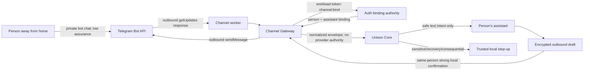

# Phase 5 Channel Gateway boundary

Status: review candidate

The appliance opens outbound HTTPS only. Telegram never connects to an appliance listener. Auth owns the external-subject-to-person binding; comms owns per-person encrypted bot credentials, update cursors, content-free audit outcomes, and encrypted drafts. A channel identity is not action authority. Low assurance cannot recover an account, expose sensitive context, or authorize consequential action.

## Stored and transmitted data

| Location | Minimum data | Plaintext content retained? |
| --- | --- | --- |
| Telegram | Bot messages and provider account/chat/network/delivery metadata | Provider-controlled; pending updates may remain up to 24 hours |
| Comms credential store | Per-person encrypted bot token, bot/account identifiers, cursor | Token ciphertext only |
| Channel audit | Provider account ID, update ID, person ID when bound, event hash, disposition, timestamp | No message content |
| Draft store | Per-person encrypted destination and text, purpose, expiry, delivery ID | Ciphertext only |
| Auth | Hashed external subject, person/assistant binding, assurance, challenge status | No bot token or message content |
| Orchestrator | Normalized current request and minimized semantic outcome | No durable channel credential |

## Failure behavior

- Unknown, unbound, reassigned, revoked, delayed, duplicate, replayed, non-private, unsupported, or rate-limited input fails closed.
- Invalid pairing responses are non-oracular. Pairing requires high local assurance, expires, and is one use.
- Provider or binding-authority outage does not advance the committed cursor. The worker reconnects with bounded backoff.
- Revocation clears the provider credential and auth binding. Reconnect requires new local pairing.
- Sensitive and recovery language produces a local step-up outcome and no remote execution.
