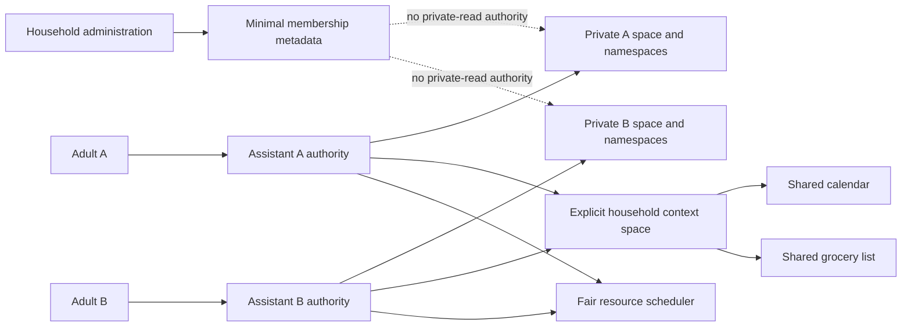

# Two-assistant household proof architecture

Status: Phase 4 review candidate

This bounded profile serves two independently consenting adults from one local
node. It does not model children, dependents, caregiving, incapacity, or
emergency access.

## Text equivalent

Adult A and Adult B authenticate to different assistant instances. Each
assistant receives different data, credential, cache, index, key, audit, and
backup namespace handles. Neither assistant can address the other's private
space. Both adults may explicitly join one household context space whose only
Phase 4 artifact types are calendar events and grocery items. Coordination reads
that shared space and reports that it read zero private sources. A fair scheduler
applies a queue, concurrency, CPU, and memory budget to each assistant. Household
administration can list only minimal operational membership metadata and can
remove a member without obtaining that person's private keys or records.

The operating-system administrator remains outside this proof's confidentiality
guarantee. Hardware-backed keys and provider-blind backup are later security work.
