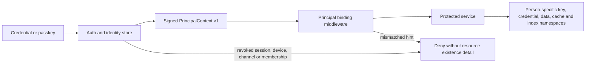

# Principal and household trust boundary

Status: Phase 1 review candidate
Contract version: `PrincipalContext` v1
Database migration: `0001_phase1_identity.sql`

## Terms

| Term | Meaning |
| --- | --- |
| Person | Stable identity for one human. It is distinct from a display name and login handle. |
| Principal | An authenticated person, device, channel, or workload that may make a request. |
| Assistant instance | The independently governed assistant assigned to one person. |
| Household | Administrative grouping for membership and appliance operations; it does not grant access to an adult member's private data. |
| Membership | A person's explicit role in one household. |
| Channel identity | A revocable binding between a provider subject and a person. |
| Workload principal | A service identity with explicit audiences and scopes. It is not a person. |

## Authority flow

Text alternative: a credential is verified against the transactional identity
store. Auth issues a signed principal context. Every protected service validates
the signature, current session, audience, and any identity hints before using the
server-derived person and isolation handles. A mismatch or revocation is denied
before a resource lookup.

## Request rules

1. `person_id`, `user_id`, `assistant_instance_id`, `household_id`, and channel
   identifiers in paths, queries, or JSON are compatibility hints only.
2. A hint that differs from the signed context is rejected. Omitting a hint never
   creates anonymous or local-person authority.
3. Services forward the signed bearer token; they do not mint or reuse a shared
   service secret. Workload tokens have explicit audiences. Person-to-workload
   delegation is short lived and preserves the originating session and person.
4. Sensitive operations fail closed when auth introspection or revocation state is
   unavailable.
5. Logs use the safe principal view and opaque handles. Keys, credentials, token
   values, and private resource existence are not included.

## Isolation handles

Each person receives independent opaque identifiers for `key_handle`,
`credential_namespace`, `data_namespace`, `cache_namespace`, and
`index_namespace`. Context, storage, communications, replay, payments,
capabilities, and actuation derive access from these handles. The local-development
key broker derives separate encryption keys per key handle and purpose; the
production interface is designed for a TPM/HSM-backed implementation.

## Enrollment, invitations, and administration

First-person enrollment requires a one-time bootstrap token, a visual/keyboard
confirmation, and an explicit household name. It creates the first person,
assistant instance, household membership, login account, and isolation handles in
one transaction. Additional adults join through single-use, expiring invitations
and receive independent isolation handles. A household administrator can invite,
lock, revoke, or remove an assistant but receives no private-data or key-export
authority.

Voice alone cannot enroll a person, register or recover a passkey, reset identity,
or unlock private data. Those flows require an authenticated semantic surface with
visible status and cancellation.

## Migration and downgrade

The legacy JSON administrator migrator requires explicit confirmation and writes
an encrypted pre-migration backup before changing identity state. Migration is
transactional and records a batch identifier. Rollback deletes only rows created
by that batch and restores the authenticated backup. Downgrading application code
without rolling back the Phase 1 identity migration is unsupported because legacy
code cannot enforce the new principal boundary.
